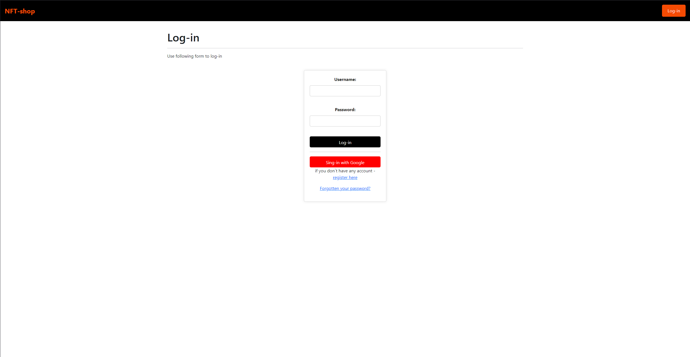
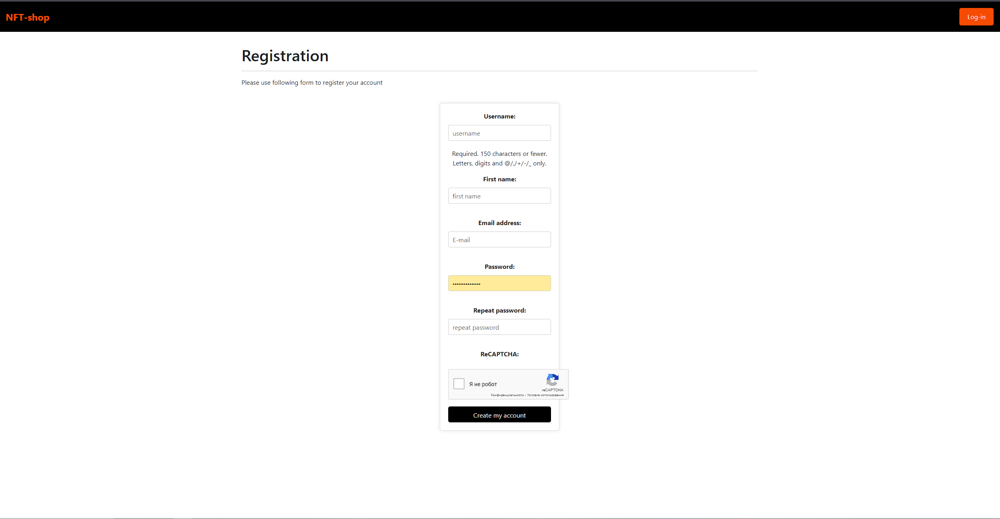
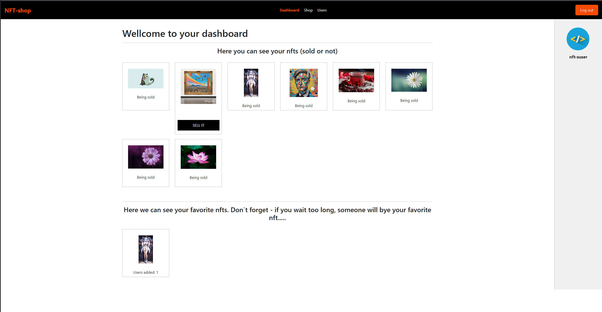
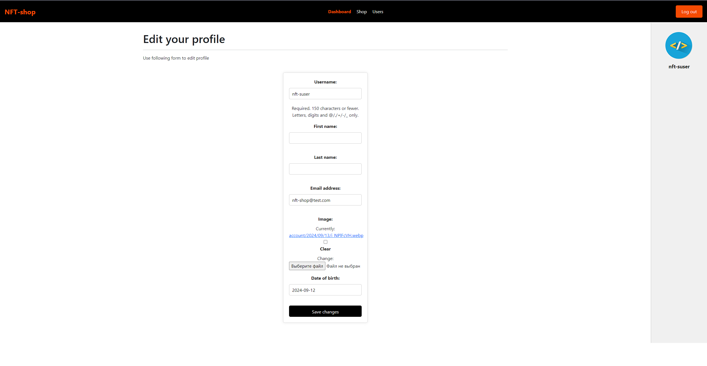
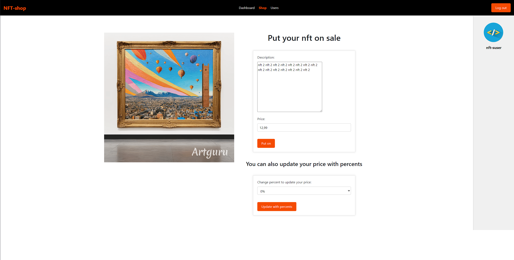
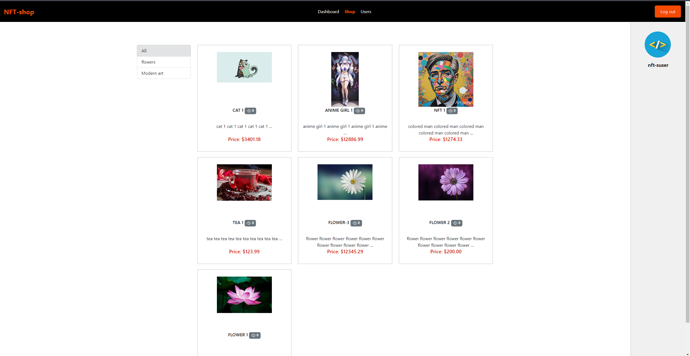
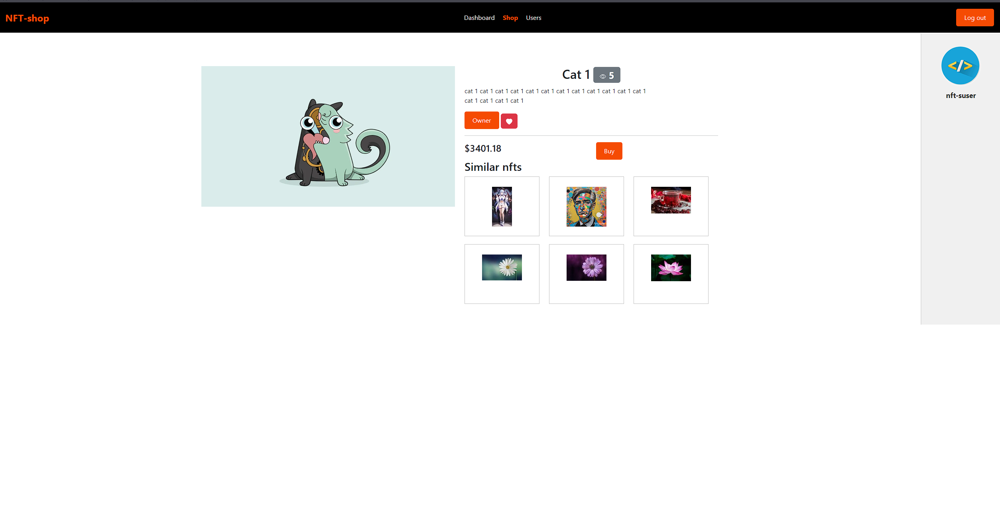
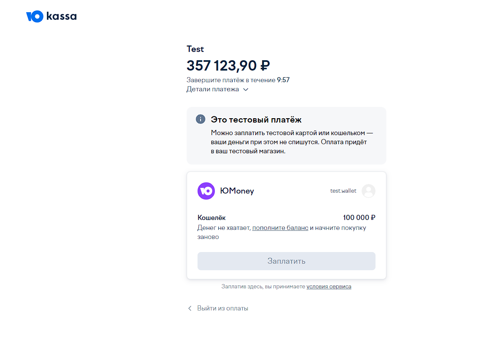
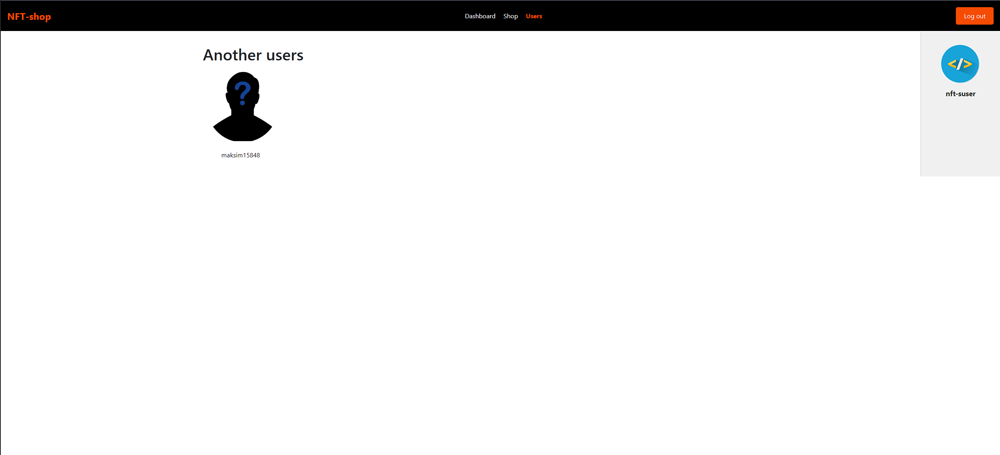
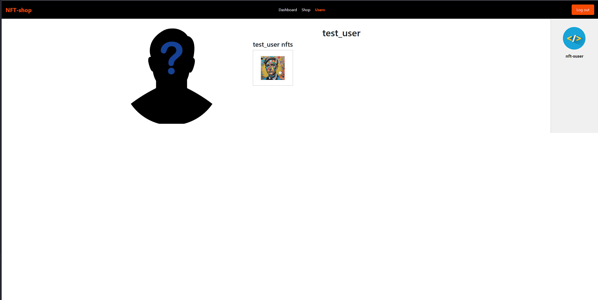

# NFT-shop

## What is NFT-shop?

NFT-shop is a platform where people can work with nft. Every person can bye nft which has 
put on sale lately and of course person can view his nft moreover he can put it on sale with custom price.
People can add nft they like in favorites and bye it later.

## How does NFT-shop work?

Here is short info about NFT-shop pages and logic

### Log-in and registration

To begin with, all users see log-in page the first. On this page user can log-in with his account or with google account.

If user does not have any accounts he can register after registration user gets code on his email.

User can also reset his password with email confirmation

### User`s dashboard

After log-in all users get on their`s dashboard which consists of two parts: nfts which have been bought, 
nfts which have been added in favorites. And also user can see sidebar with his avatar and button to log-out.

And also user can see sidebar with his avatar. If user click on it he will get on edit profile form.

And finally, if user presses on 'sell it' button (user's nft isn't on sale), user can put nft on sale. 

### Shop page

Shop page contains all nfts which have been put on sale. Here user can filter nfts by categories 
and see nfts views.

If user clicks on the nft, he wil get on nft-detail page. Here he can add the nft on his favorites, 
see nft's views. User can also look at similar nfts moreover if user click on similar nft, he will
get on similar nft's page

And finally user can buy nft. if he presses buy button, he will get on yookassa payment page

### Users page

The last page of NFT-shop is users. Here we can see list of all active users (without current user).

If user clicks on user in list, he will get on selected user detail page with his nfts.

